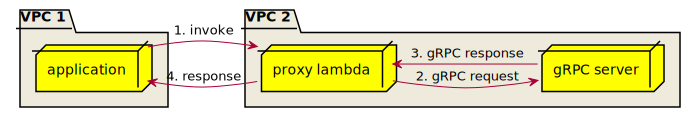

# gRPC proxy lambda in Go

This lambda function proxies gRPC invocation between VPCs.



1. invoke proxy lambda with base64 encoded protobuf message.
2. call gRPC method with raw protobuf message.
3. get gRPC response.
4. response with base64 encoded protobuf message.

## Requirements
* go 1.11+
* [aws-cli](https://docs.aws.amazon.com/ko_kr/cli/latest/userguide/cli-chap-install.html)
* make
* zip

## Quick Start
1. [Define a role](https://console.aws.amazon.com/iam/home#/roles) with `AWSLambdaBasicExecutionRole` policy. 
2. Replace `ROLE_ARN` variable with your role ARN.

```bash
# install dependencies
$ go get && go mod vendor

# compile linux binary
$ make build-linux

# create a deployment package by packaging the executable in a ZIP file. 
$ make zip

# use AWS CLI to create a function
$ ROLE_ARN={your role ARN} \
  make create-function

# synchronous invocation 
$ make invoke

# clean output
$ make clean

# delete lambda function
$ make delete-function
```


